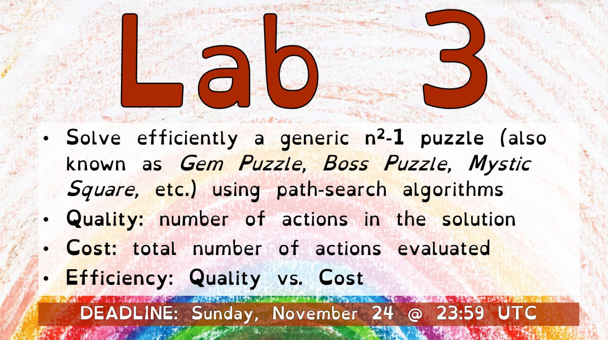

## Lab 3 of the Computational Intelligence Course at PoliTO

*All rights of the image goes to Giovanni Squillero*

## Choices rationale
- **Algorithm:** After first implementing a basic BFS, I realized that it was way too slow, so I opted for an A* algorithm. 
This algorithm is guaranteed to be optimal iff the chosen heuristic is admissable(that is, it never overestimates the cost).
- **Heuristic:** I first tried the simple *tiles-out-of-place heuristic* which returns the number of tiles that are not in the correct position.
Although it's admissable, it didnt perform very well, so I then decided to implement and stick with the *Manhattan distance heuristic* which performed considerably better.
- **State representation:** I chose to represent the state as a class containing a matrix of the current state along with  *f* and *g* values.
Some methods were implemented as to perform the necessary operations regarding the priority queue.
- **Priority queue:** I used the `heapq` module to implement the priority queue. There's also a *no-heap* implementation that relies on sorting the list at each iteration but for obvious reasons it's way slower.

## Credits
To check if my implementation was correct I used this [website](https://tristanpenman.com/demos/n-puzzle/) to run a few tests.
Also, I used the [Wikipedia page](https://en.wikipedia.org/wiki/A*_search_algorithm) to implement the A* algorithm.
Finally, to check if a puzzle was solvable I checked various stackexchange threads.
